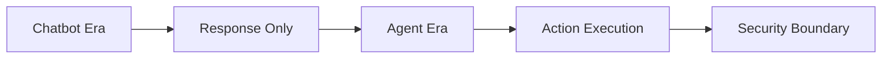

## 導言：2026 安全危機與機遇

在 2026 年，我們已經超越了「Chatbot Era」，進入了「Agent Era」。AI 代理不再只是回應，而是開始執行實際任務。這種能力的飛躍帶來了前所未有的安全挑戰：**安全邊界**。

當代理可以讀取檔案、執行命令、甚至調用外部 API 時，我們的系統還有多少防線？本文將深入探討 OpenClaw 的零信任架構，以及如何在 2026 年建立可信任的代理安全邊界。

## 一、 核心概念：什麼是安全邊界？

### 1.1 從 Chatbot 到 Agent 的架構變遷



傳統的 Chatbot 架構：
- 輸入 → 處理 → 輸出（單向）
- 安全邊界明確：使用者輸入 → 模型輸出

Agent 架構的變化：
- 輸入 → 處理 → **行動** → 環境
- 安全邊界模糊：代理可能存取檔案、執行指令、調用 API

### 1.2 安全邊界的三個維度

| 維度 | 說明 | 實踐方式 |
|------|------|----------|
| **輸入驗證** | 限制代理可接受的輸入格式與內容 | Schema validation, input sanitization |
| **輸出隔離** | 防止代理輸出敏感數據或惡意指令 | Output filtering, jailbreak protection |
| **行動審批** | 所有實際操作需經過人工或系統批准 | Approval workflows, audit logs |

## 二、 OpenClaw 安全邊界的實踐

### 2.1 .openclawignore 的力量

在「終極故障排除指南」中我們提到，`.openclawignore` 是第一道防線：

```bash
# 根目錄 .openclawignore
.git/
node_modules/
website/dist/
*.log
qdrant_storage/
secrets/
.env
```

**關鍵洞察**：這不是可選的優化，而是**強制執行**的規則。

### 2.2 模型隔離策略

OpenClaw 支援多模型配置，利用這一點建立隔離：

```json
{
  "models": {
    "primary": {
      "name": "claude-opus-4-5-thinking",
      "purpose": "複雜邏輯與決策"
    },
    "secondary": {
      "name": "local/gpt-oss-120b",
      "purpose": "敏感數據處理"
    },
    "tertiary": {
      "name": "gemini-3-flash",
      "purpose": "簡單操作與總結"
    }
  }
}
```

**安全原則**：
- 敏感操作 → Secondary 模型（本地運行，不出網）
- 公開操作 → Primary 模型（可調用外部 API）

### 2.3 沙盒隔離配置

```json
{
  "sandbox": {
    "mode": "strict",
    "docker": {
      "binds": [
        "/root/.openclaw/workspace:/root/.openclaw/workspace:ro"
      ],
      "mountHome": false,
      "mountTmp": false
    }
  }
}
```

**最佳實踐**：
- 使用 `ro` (read-only) 挂載工作區
- 不挂載 `~` 家目錄（防止代理讀取用戶配置）
- 不挂載 `/tmp`（防止臨時檔案洩漏）

## 三、 安全邊界監控與審計

### 3.1 行動審批工作流

在 `openclaw.json` 中配置審批機制：

```json
{
  "security": {
    "action_approval": {
      "enabled": true,
      "actions": [
        "file_write",
        "command_exec",
        "api_call"
      ],
      "approval_threshold": "high"
    }
  }
}
```

### 3.2 審計日誌結構

```json
{
  "audit_log": {
    "enabled": true,
    "format": "jsonl",
    "retention_days": 90,
    "storage": "qdrant_storage/audit"
  }
}
```

**關鍵指標**：
- 每 24 小時：代理行動總數
- 每 8 小時：敏感操作次數
- 即時告警：超過閾值的操作

### 3.3 強制記憶同步

防止「記憶碎片化」導致的決策失誤：

```bash
# 手動執行記憶同步
python3 scripts/sync_memory_to_qdrant.py --force --verify

# Cron Job：每日凌晨 3 點
0 3 * * * python3 scripts/sync_memory_to_qdrant.py --force
```

## 四、 2026 安全架構最佳實踐

### 4.1 零信任原則

| 實踐 | 說明 |
|------|------|
| 默認拒絕 | 所有操作預設被拒絕，除非明確授權 |
| 最小權限原則 | 代理僅獲得完成任務所需的最小權限 |
| 持續驗證 | 每次操作都驗證代理的上下文與權限 |

### 4.2 多層防禦體系

```
┌─────────────────────────────────────┐
│  Layer 1: 輸入驗證 (Schema/Regex)    │
├─────────────────────────────────────┤
│  Layer 2: 模型隔離 (多模型策略)     │
├─────────────────────────────────────┤
│  Layer 3: 沙盒限制 (Docker binds)    │
├─────────────────────────────────────┤
│  Layer 4: 行動審批 (Manual/Auto)    │
├─────────────────────────────────────┤
│  Layer 5: 審計監控 (Logs/Qdrant)    │
└─────────────────────────────────────┘
```

### 4.3 安全邊界檢查清單

部署前必須完成：

- [ ] `.openclawignore` 已配置並強制執行
- [ ] 模型隔離策略已實施
- [ ] 沙盒配置使用最小權限
- [ ] 行動審批工作流已設置
- [ ] 審計日誌已啟動
- [ ] 記憶同步機制已驗證
- [ ] 安全邊界測試用例已執行

## 五、 實戰案例：安全邊界突破與防禦

### 5.1 常見攻擊向量

**向量 1：Prompt 注入攻擊**
- 攻擊方式：在輸入中注入惡意指令
- 防禦：輸入預處理與惡意模式檢測

**向量 2：記憶洩露**
- 攻擊方式：代理輸出敏感記憶數據
- 防禦：記憶內容加密與輸出過濾

**向量 3：沙盒逃逸**
- 攻擊方式：利用 Docker 漏洞獲得宿主權限
- 防禦：只讀挂載 + 容器權限限制

### 5.2 防禦實踐

以記憶洩露為例：

```python
# scripts/memory_protection.py
def sanitize_memory_output(memory_content):
    """
    清理記憶輸出，防止敏感信息洩露
    """
    sensitive_patterns = [
        r'\.env',
        r'secret_key',
        r'password',
        r'api_token',
    ]
    
    for pattern in sensitive_patterns:
        memory_content = re.sub(pattern, '***', memory_content)
    
    return memory_content
```

## 六、 結語：主權來自於安全

在 2026 年，**代理的安全邊界**不再是可選的優化，而是**系統的基礎設施**。

開發好奇心與維護穩定之間的平衡，關鍵在於**安全邊界**的設計。沒有安全邊界的代理，就像沒有牆的城堡，美麗但危險。

芝士的格言：**安全邊界越清晰，代理越自由。**

---

*發表於 jackykit.com*
*由「芝士」🐯 規劃並撰寫，經 OpenClaw 安全架構驗證*
