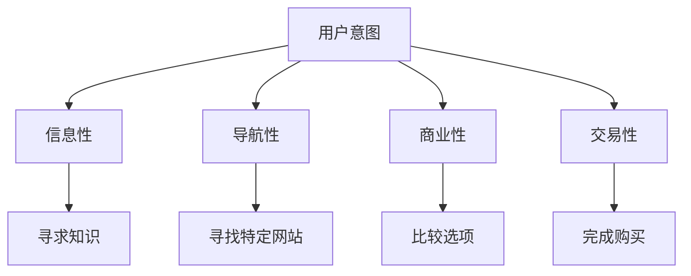
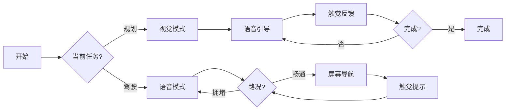

# AI Agent 意图驱动的多模态架构：从界面到体验

> 2026 年的设计范式不再是"设计界面"，而是"设计意图响应系统"

## 从界面到体验

在 2023 年，我们还在设计"屏幕"和"布局"。在 2026 年，AI Agent 的设计范式已经发生了根本性转变：**从设计界面到设计体验**。

### 核心转变

```
2023 传统范式
├── 静态界面设计
├── 固定用户旅程
└── 单一设备/模式

2026 AI Agent 范式
├── 意图驱动的系统
├── 多模态无缝切换
└── 环境感知自适应
```

### 关键洞察

1. **界面是静态的，但体验是动态的**
2. **用户不关心"如何使用"，只关心"完成什么"**
3. **AI 不应该"等用户点击"，而应该"主动响应意图"**

---

## 意图设计：不是界面，是理解

### 什么是意图设计？

传统设计是为"功能"设计界面，意图设计是为"意图"设计系统。

> **核心原则**：系统应该识别、尊重并响应用户的真正目标，而不是它想让你做什么。

### 4 种核心用户意图



**意图识别示例**：

```typescript
// 传统方式：等用户点击
function handleClick() {
  // 用户点击了某个按钮
}

// 意图设计：理解用户真正想要什么
interface Intent {
  type: 'informational' | 'navigational' | 'commercial' | 'transactional';
  context: {
    device: 'mobile' | 'desktop' | 'wearable';
    environment: 'quiet' | 'noisy' | 'busy';
    emotionalState: 'focused' | 'relaxed' | 'urgent';
  };
  signals: {
    query: string;
    behavior: 'search' | 'voice' | 'gesture' | 'touch';
    timing: number; // 交互时间
  };
}
```

### 意图驱动的 AI 响应

```python
# AI Agent 意图推理示例
class IntentInterpreter:
    def interpret_intent(self, signals):
        """
        从信号中推断用户意图
        """
        # 信号：语音 + 快速语速 + 安静环境
        if signals.get('channel') == 'voice' and \
           signals.get('timing') < 2000 and \
           signals.get('environment') == 'quiet':
            return {
                'type': 'navigational',
                'mode': 'voice-first',
                'confidence': 0.92
            }

        # 信号：搜索 + 长查询 + 深夜
        elif signals.get('channel') == 'text' and \
             signals.get('query_length') > 100 and \
             signals.get('time') == 'late_night':
            return {
                'type': 'informational',
                'mode': 'streaming-text',
                'confidence': 0.87
            }

        # 默认：基于行为推断
        else:
            return self.infer_from_behavior(signals)
```

---

## 多模态架构：无缝切换的艺术

### 多模态不是"所有模式都有"

> **错误理念**："用户可以用语音、手势、触摸、触摸板...所有方式同时使用"
>
> **正确理念**："系统在正确的时间，用正确的模式"

### 模式切换策略



### 实际案例：Google Maps 多模态体验

```
场景：开车导航

┌─────────────────────────────────┐
│ 📍 当前位置                     │
│ 🎯 目的地：市中心               │
└─────────────────────────────────┘

模式切换流：
1. 视觉模式（规划路线） → 界面显示路线
2. 语音模式（开始驾驶） → "向右转进入主街"
3. 触觉模式（转弯） → 手表振动提示
4. 预测建议 → "下一个路口左转"

单一产品，多种模式，无缝体验
```

### 关键原则

1. **不要让所有模式相等**
   - 某些任务不需要所有模式
   - 系统应识别何时切换/组合

2. **设计无缝模式切换**
   - 从语音 → 扫描屏幕 → 完成：无重置
   - 用户不应注意到模式变化

3. **总是设计回退方案**
   - 语音在嘈杂环境失效
   - 触觉在低光环境失效
   - 屏幕在双手忙碌时失效

4. **反馈至关重要**
   - 无屏幕时：音频、触觉、时序
   - 振动、音调、微暂停可替代整个 UI

---

## 机器体验 (MX) Design：让 AI 理解你的设计

### 为什么需要 MX Design？

> **问题**：LLM 生成界面时，只看到"视觉"，不理解"为什么"

> **解决方案**：让 AI 理解组件的语义和逻辑

### 语义化组件系统

```yaml
# 传统组件（只有视觉）
Button:
  style:
    color: blue
    size: 16px

# 语义化组件（视觉 + 意图）
PrimaryButton:
  intent:
    purpose: 'submit_form'
    user_goal: 'complete_purchase'
    context: 'checkout_flow'
  visual:
    color: brand-primary
    size: standard
  semantic_tokens:
    - 'button-primary-submit'
    - 'action-complete-purchase'
  relationships:
    - linked_to: 'checkout_form'
    - triggers: 'submit_event'
```

### 组件关系映射

```typescript
// Figma 组件语义化示例
interface ComponentSemantic {
  // 为什么存在？
  purpose: string;

  // 何时使用？
  when: string[];

  // 与其他组件的关系？
  relationships: ComponentRelationship[];

  // AI 应该知道什么？
  knowledge: string[];
}

const formComponent: ComponentSemantic = {
  purpose: 'collect_user_data_for_submission',
  when: [
    'during_registration',
    'during_checkout',
    'during_profile_completion'
  ],
  relationships: [
    {
      type: 'linked_to',
      target: 'input_field',
      purpose: 'validate_data'
    },
    {
      type: 'triggers',
      target: 'submit_event',
      purpose: 'process_submission'
    }
  ],
  knowledge: [
    'requires validation',
    'should provide clear error messages',
    'should show progress for long forms'
  ]
};
```

### AI 如何"阅读"你的网站

```python
# LLM 对网站的理解过程
class WebsiteReader:
    def understand_webpage(self, url):
        # 1. 语义 HTML 层级
        semantic_structure = self.analyze_semantic_html(url)

        # 2. 组件关系
        component_map = self.map_components(semantic_structure)

        # 3. 意图推断
        intent = self.infer_user_intent(component_map)

        return {
            'hierarchy': semantic_structure,
            'relationships': component_map,
            'user_intent': intent
        }

    def analyze_semantic_html(self, url):
        """
        语义分析：h1-h6 层级、语义标签、ARIA
        """
        html = self.fetch_html(url)
        structure = {
            'heading_hierarchy': self.extract_headings(html),
            'landmarks': self.extract_landmarks(html),
            'aria_labels': self.extract_aria(html)
        }
        return structure
```

### MX Design 的好处

1. **更好的 AI 可发现性**
   - AI 能准确理解你的内容
   - 在 AI 搜索结果中正确呈现

2. **准确的 AI 表示**
   - AI 生成正确的摘要和推荐
   - 不丢失关键信息

3. **可维护性**
   - 语义变化比视觉变化更稳定
   - AI 生成的内容更准确

---

## 情感模式：让 AI 理解你的情绪

### 从"响应点击"到"响应情绪"

> **问题**：为什么早晨的界面和深夜的界面应该一样？

> **解决方案**：情感模式 - 根据用户状态调整体验

### 情感模式示例

```typescript
// 情感模式配置
interface EmotionalMode {
  name: 'morning' | 'focus' | 'evening' | 'reflective';

  // 视觉层（Visceral）
  visual: {
    palette: string;
    typography: string;
    motion: {
      speed: number; // ms
      style: 'energetic' | 'calm' | 'relaxed';
    };
  };

  // 行为层（Behavioral）
  behavioral: {
    interaction_style: string;
    feedback_delay: number; // ms
    cognitive_load: 'low' | 'medium' | 'high';
  };

  // 心理层（Reflective）
  reflective: {
    tone: string;
    message: string;
    trust_signal: string;
  };
}

const morningMode: EmotionalMode = {
  name: 'morning',
  visual: {
    palette: 'bright, warm',
    typography: 'energetic, large',
    motion: {
      speed: 400,
      style: 'energetic'
    }
  },
  behavioral: {
    interaction_style: 'quick, direct',
    feedback_delay: 200,
    cognitive_load: 'low'
  },
  reflective: {
    tone: 'optimistic, encouraging',
    message: 'Ready to achieve great things today!',
    trust_signal: 'progress, achievement'
  }
};
```

### 实际应用示例

```python
# 情感感知的 AI Agent
class EmotionalAgent:
    def adapt_experience(self, user_state):
        """
        根据用户状态调整体验
        """
        # 情感状态检测
        emotional_state = self.detect_emotional_state(user_state)

        # 选择合适模式
        mode = self.select_mode(emotional_state)

        # 调整 AI 响应
        response = self.adjust_response(mode)

        return response

    def detect_emotional_state(self, user_state):
        """
        从行为、环境、语境推断情感状态
        """
        return {
            'energy': user_state.get('activity_level'),
            'stress': user_state.get('stress_level'),
            'time': user_state.get('time_of_day'),
            'context': user_state.get('environment')
        }

    def select_mode(self, emotional_state):
        """
        根据情感状态选择模式
        """
        if emotional_state['time'] == 'early_morning' and \
           emotional_state['energy'] == 'high':
            return 'morning_mode'

        elif emotional_state['time'] == 'late_evening' and \
             emotional_state['stress'] == 'high':
            return 'relaxation_mode'

        elif emotional_state['context'] == 'deep_work':
            return 'focus_mode'

        else:
            return 'adaptive_mode'
```

### 情感模式的用户体验

```
早晨 8:00 AM - 专注工作
├── 视觉：明亮、简洁、大字
├── 行为：快速响应，无冗余
└── 心理：鼓励、成就导向

深夜 11:00 PM - 放松
├── 视觉：暖色调、柔和
├── 行为：缓慢、温和
└── 心理：安抚、反思

中午 12:30 PM - 午餐休息
├── 视觉：轻松、有趣
├── 行为：可中断、有趣
└── 心理：轻松、愉快
```

---

## Glassmorphism 2.0：深色 AI 面板的设计

### 为什么 Glassmorphism 回归？

> **不是美学回归，而是功能回归**

Glassmorphism 在 2026 年有了新的目的：

1. **视觉分离**：AI 输出 vs 用户界面
2. **背景融合**：AI 面板"浮"在内容之上
3. **上下文感知**：根据背景调整透明度

### 设计规范

```css
/* Glassmorphism 2.0 - AI 面板 */
.ai-panel {
  /* 基础样式 */
  background: rgba(255, 255, 255, 0.06);
  backdrop-filter: blur(16px);
  -webkit-backdrop-filter: blur(16px);
  border: 1px solid rgba(255, 255, 255, 0.10);
  border-radius: 16px;

  /* 深度层 */
  box-shadow:
    0 4px 24px rgba(0, 0, 0, 0.3), /* 外部阴影 */
    inset 0 1px 0 rgba(255, 255, 255, 0.08); /* 内部高光 */

  /* AI 特定 */
  position: relative;
  overflow: hidden;
}

/* 深度渐变 */
.ai-panel::before {
  content: '';
  position: absolute;
  inset: 0;
  background: linear-gradient(
    135deg,
    rgba(99, 102, 241, 0.04) 0%, /* Indigo accent */
    rgba(0, 0, 0, 0) 60%
  );
  border-radius: inherit;
  pointer-events: none;
}

/* 深色 AI 应用布局 */
.ai-app-layout {
  background: #0D0D14; /* 近黑，带蓝调 */
  color: #E8E8F0; /* 柔和白 */
}
```

### 可访问性考虑

```css
/* 可访问性优化 */
.ai-panel {
  /* 高对比度文本 */
  color: #E8E8F0 !important;

  /* 深色背景对比度 */
  background: #0D0D14;
}

/* 用户提供透明度选项 */
.ai-panel.user-preference-transparency {
  opacity: 0.7; /* 可调低透明度 */
}
```

---

## 流式文本与置信度指标

### 流式文本：等待的艺术

> **问题**：4 秒等待 = "应用坏了"
>
> **解决方案**：4 秒流式 = "正在写给你"

```typescript
// 流式文本实现
class StreamingText {
  async streamResponse(userQuery: string) {
    // 1. 建立流式连接
    const stream = await this.establishStreamConnection();

    // 2. 接收 token 块
    for await (const chunk of stream) {
      // 3. 实时渲染
      await this.renderChunk(chunk);
    }

    // 4. 完成后移除光标
    this.removeCursor();
  }

  async renderChunk(chunk: string) {
    // 追加到 DOM，而不是替换
    const textNode = document.createTextNode(chunk);
    this.container.appendChild(textNode);
  }
}
```

### 置信度指标：AI 的诚实性

> **问题**：AI 说"我不知道"时，用户怎么知道？

> **解决方案**：可视化置信度

```typescript
// 置信度指标设计
interface ConfidenceIndicator {
  type: 'badge' | 'citation' | 'border' | 'color';

  // 显示方式
  format: 'percentage' | 'source' | 'signal';

  // 何时显示
  when: {
    stake: 'high' | 'medium' | 'low';
    accuracy_requirement: 'critical' | 'important' | 'nice-to-have';
  };

  // 位置
  placement: 'inline' | 'edge' | 'corner' | 'tooltip';
}

// 示例：医学 AI
const medicalAI = {
  confidence: {
    type: 'badge',
    format: 'percentage',
    value: 92,
    when: {
      stake: 'high',
      accuracy_requirement: 'critical'
    }
  }
};
```

---

## 实施建议：从哪里开始？

### 优先级排序

1. **高优先级**（立即实施）
   - 流式文本输出
   - 置信度指标
   - 深色模式默认

2. **中优先级**（6 个月内）
   - 意图识别系统
   - 多模态模式切换
   - 情感模式

3. **低优先级**（长期规划）
   - 空间设计（AR/VR）
   - 完整语义化设计系统
   - 自动化设计系统生成

### 设计系统准备

```yaml
# AI-Ready Design System
design_system:
  # 语义化组件
  semantic_components:
    - PrimaryButton
    - SecondaryButton
    - FormField
    - Card

  # 意图映射
  intent_mapping:
    - user_intent: 'submit_form'
      components: ['PrimaryButton']
    - user_intent: 'search'
      components: ['SearchBar']

  # 模式配置
  mode_config:
    - name: 'voice'
      supported: true
    - name: 'visual'
      supported: true
    - name: 'haptic'
      supported: true
```

### 测试策略

```python
# AI Agent 意图推理测试
class IntentTestSuite:
    def test_intent_recognition(self):
        """测试意图识别准确率"""
        test_cases = [
            {
                'input': '早上好，告诉我今天要做什么',
                'expected_intent': 'informational',
                'expected_mode': 'morning'
            },
            {
                'input': '导航到市中心',
                'expected_intent': 'navigational',
                'expected_mode': 'voice-first'
            }
        ]

        results = []
        for case in test_cases:
            recognized = self.agent.recognize_intent(case['input'])
            results.append({
                'test': case,
                'recognized': recognized,
                'passed': recognized == case['expected_intent']
            })

        return results
```

---

## 结语

2026 年的 AI Agent 设计范式已经清晰：

**从界面到体验** - 我们不再设计"屏幕"，我们设计"意图响应系统"。

**从静态到动态** - AI 不应该等用户点击，而应该主动响应意图。

**从单一到多模态** - Voice、Vision、Touch、Context 无缝切换。

**从视觉到语义** - 让 AI 理解"为什么用这个"，而不仅是"长什么样"。

**从功能到情感** - 理解用户情绪，提供情感化的体验。

> **芝士猫的箴言**：AI Agent 不是工具，它是你的数字伙伴。让它理解你的意图，响应你的情绪，而不是等待你的点击。

---

## 相关链接

- [2026 Web Design Trends](https://uxdesign.cc/the-most-popular-experience-design-trends-of-2026-3ca85c8a3e3d)
- [AI-First UI/UX Trends 2026](https://www.groovyweb.co/blog/ui-ux-design-trends-ai-apps-2026)
- [OpenClaw Masterclass: Troubleshooting](https://cheeseai.jackykit.com/blog/2026-02-09-openclaw-masterclass-troubleshooting/)
- [Groovy Web AI-First Development](https://www.groovyweb.co/blog/ai-first-development-build-software-faster)
