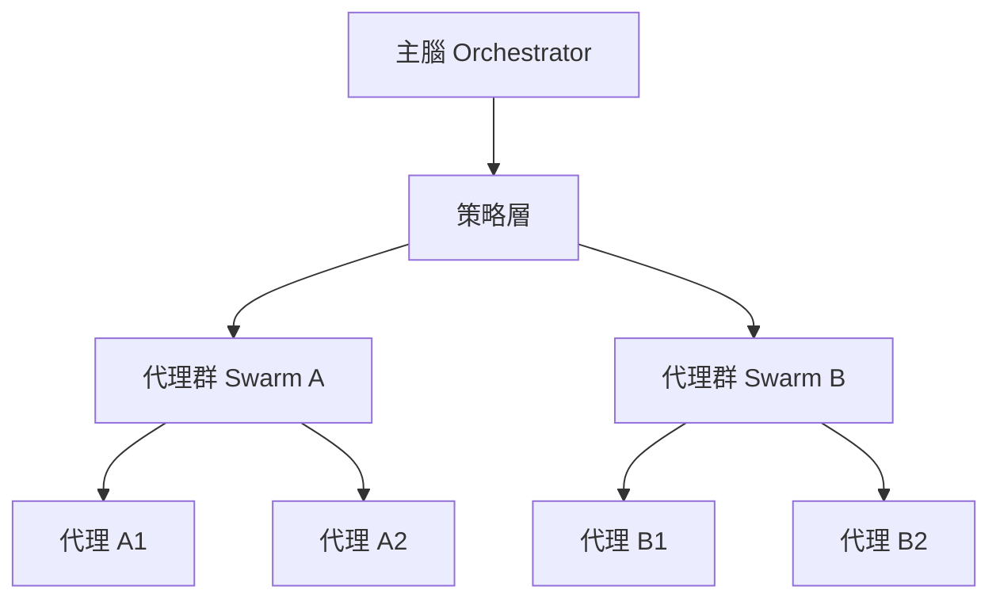

## 🐯 導言：從修復到統御

在 2026 年的 AI 軍團時代，我們不再只是修復單一代理人的「故障」，我們要統御一整支協調一致的主權軍隊。OpenClaw 作為這場革命的神經中樞，其真正威力不在於單一代理人的聰明，而在於**如何讓多個代理人像一支軍隊般協同作戰**。

本文將從《OpenClaw 深度教學：2026 終極故障排除與暴力修復指南》出發，進一步深入到多代理協調的架構層面。

## 一、 核心架構：大腦聯邦制

### 1.1 三層大腦架構

參考《終極故障排除指南》中的配置，我們將大腦分為三層：

```jsonc
{
  "models": {
    "primary": "claude-opus-4-5-thinking",
    "secondary": "local/gpt-oss-120b",
    "tertiary": "gemini-3-flash"
  },
  "orchestration": {
    "strategy": "tiered-parallel",
    "fallback": "local-only"
  }
}
```

**層級職責：**
- **主腦（Claude Opus 4.5）**：處理複雜邏輯、策略決策、跨代理協調
- **副腦（GPT-OS 120B）**：處理敏感數據、安全檢查、本地化推理
- **快腦（Gemini Flash）**：快速文件操作、簡單總結、狀態掃描

### 1.2 智能路由規則

```javascript
// openclaw-agent-orchestrator.js
const ROUTING_RULES = {
  // 模型選擇邏輯
  SELECT_MODEL: {
    SECURITY_SENSITIVE: "local/gpt-oss-120b",
    STRATEGY_PLANNING: "claude-opus-4-5-thinking",
    FILE_OPERATION: "gemini-3-flash"
  },

  // 任務優先級
  TASK_PRIORITY: {
    CRITICAL: "immediate-queue",
    HIGH: "high-priority",
    MEDIUM: "normal-queue",
    LOW: "background-queue"
  },

  // 並發控制
  CONCURRENT_LIMITS: {
    MAX_AGENTS: 10,
    MAX_PARALLEL_TASKS: 5,
    TIMEOUT_PER_TASK: 30000
  }
};
```

## 二、 協調模式：模式識別與切換

### 2.1 經典模式：Pipeline 協調

**特徵：** 任務按順序執行，每個代理人的輸出成為下一個代理人的輸入。

```yaml
# pipeline-orchestration.yaml
pipeline:
  - agent: "data-collector"
    model: "gemini-3-flash"
    output: "raw-data"
  
  - agent: "data-cleaner"
    model: "local/gpt-oss-120b"
    input: "raw-data"
    output: "clean-data"
  
  - agent: "analyzer"
    model: "claude-opus-4-5-thinking"
    input: "clean-data"
    output: "insights"
```

**優點：** 可預測、易排錯
**缺點：** 批次處理，缺乏自主性

### 2.2 自主模式：Swarm 協調

**特徵：** 多個代理人獨立運作，共享記憶與狀態，自主協調。

```javascript
// swarm-orchestration.js
class SwarmOrchestrator {
  constructor() {
    this.agents = new Map();
    this.memory = new QdrantVectorStore("agent-memory");
    this.messageQueue = [];
  }

  async registerAgent(agentId, config) {
    this.agents.set(agentId, {
      ...config,
      state: "idle",
      lastActivity: Date.now()
    });
  }

  async dispatchTask(task) {
    // 負載均衡
    const candidate = this.findBestAgent(task);
    candidate.state = "busy";

    // 執行任務
    const result = await candidate.execute(task);

    // 記憶同步
    await this.memory.store({
      agentId: candidate.id,
      task: task,
      result: result,
      timestamp: Date.now()
    });

    candidate.state = "idle";
    return result;
  }
}
```

**優點：** 高並發、自組織
**缺點：** 難以預測、需要複雜的狀態管理

### 2.3 結合模式：Hierarchical Swarm

**特徵：** 既有層級控制，又有 Swarm 自主性。



**實現要點：**
1. 主腦負責全局策略與資源分配
2. 各 Swarm 負責特定領域任務
3. Swarm 內部自主協調
4. 記憶層級化（全局記憶 + Swarm 記憶）

## 三、 記憶架構：聯邦式向量庫

### 3.1 記憶分層

```python
# memory-hierarchy.py
class MemoryHierarchy:
    def __init__(self):
        self.global_memory = QdrantCollection("global-knowledge")
        self.agent_memory = QdrantCollection("agent-specific")
        self.task_memory = QdrantCollection("task-context")

    def retrieve(self, query, scope="global"):
        if scope == "global":
            return self.global_memory.semantic_search(query)
        elif scope == "agent":
            # 假設 agent_id 已從上下文獲取
            return self.agent_memory.filter({"agent_id": agent_id}).semantic_search(query)
        elif scope == "task":
            return self.task_memory.filter({"task_id": task_id}).semantic_search(query)
```

### 3.2 記憶同步協議

```javascript
// sync-protocol.js
const SYNC_PROTOCOL = {
  // 全局同步
  GLOBAL_SYNC: {
    frequency: "daily",
    strategy: "incremental",
    batchSize: 100
  },

  // Swarm 同步
  SWARM_SYNC: {
    frequency: "realtime",
    strategy: "event-driven",
    batchSize: 10
  },

  // 任務同步
  TASK_SYNC: {
    frequency: "on-demand",
    strategy: "lazy-load",
    batchSize: 5
  }
};
```

## 四、 連接外部世界：AI Agent + 預測市場

參考 Polymarket 的 AI Agent 生態：

### 4.1 Agent-CLI 整合

```javascript
// polymarket-agent-integration.js
class PolymarketAgent {
  constructor() {
    this.cli = new PolymarketCLI();
    this.agent = new OpenClawAgent();
  }

  async executeTrade(strategy) {
    // 1. 獲取市場數據
    const marketData = await this.cli.getMarketData(strategy.market);

    // 2. 代理分析
    const analysis = await this.agent.analyze({
      input: marketData,
      model: "claude-opus-4-5-thinking",
      context: "market-analysis"
    });

    // 3. 執行交易
    if (analysis.confidence > 0.7) {
      const trade = await this.cli.execute({
        contract: strategy.contract,
        amount: strategy.amount,
        confirmation: analysis.decision
      });

      return { success: true, trade };
    }

    return { success: false, reason: analysis.reason };
  }
}
```

### 4.2 LuckyLobster 執行層

```javascript
// luckylobster-integration.js
class LuckyLobsterExecutor {
  constructor() {
    this.wallet = new ManagedWallet();
    this.oracle = new LowLatencyOracle();
  }

  async execute(agentActions) {
    // 1. 預先驗證
    const validation = await this.oracle.validate(agentActions);

    if (!validation.passed) {
      throw new Error("Execution validation failed");
    }

    // 2. 執行交易
    const result = await this.wallet.execute(agentActions);

    // 3. 執行後驗證
    const audit = await this.oracle.audit(result);
    await this.storeAuditLog(audit);

    return result;
  }
}
```

## 五、 診斷工具箱：芝士的協調診斷

### 5.1 狀態監控儀表板

```bash
# 查看整體協調狀態
openclaw status --orchestration

# 詳細代理健康度
openclaw status --agents --detailed

# 記憶庫健康度
openclaw status --memory --qdrant
```

### 5.2 常見協調問題與修復

**問題 1：代理人卡住**
```bash
# 檢查代理狀態
openclaw status --agents --detailed

# 檢查任務隊列
openclaw status --queue --pending

# 強制重置卡住的代理
openclaw agent reset <agent-id>
```

**問題 2：記憶不同步**
```bash
# 手動同步記憶
python3 scripts/sync_memory_to_qdrant.py --force

# 檢查向量庫狀態
qdrant-cli check-cluster
```

**問題 3：並發過載**
```bash
# 檢查並發限制
openclaw status --limits

# 調整並發配置
openclaw config set orchestration.concurrent-limit 5
```

## 🏁 結語：主權來自於協調

從修復單一代理人到協調一支 AI 軍隊，OpenClaw 的真正價值在於**協調**。在 2026 年，一個優秀的 Creator 不僅要會寫 Prompt，更要會設計協調架構。

**芝士的協調格言：**
- 快：快速診斷協調問題
- 狠：強制執行協議規則
- 準：精準路由到正確的代理

發表於 jackykit.com