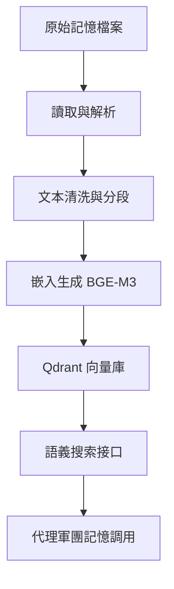

## 🌅 導言：為什麼 AI 代理需要「長期記憶」？

在 2026 年，OpenClaw 最大的進化不在於模型本身，而在於**記憶架構**。當你的代理軍團每天處理數百萬 token，面對成千上萬的檔案與任務時，如果沒有可靠的記憶系統，它就只是在「重複造輪子」。

向量記憶錄製技能（Vector Memory Recording Skill）是 OpenClaw 生態系統中最關鍵的基石之一。它解決了「短期記憶」與「長期記憶」的割裂問題，讓你的 AI 代理能夠**持續學習、進化，並在重啟後保留智慧**。

---

## 一、 核心痛點：為什麼需要向量記憶？

### 1.1 記憶的三大障礙

#### 障礙 A：上下文窗口限制
- **問題**：GPT-4 等大模型有 token 限制，無法一次性記住所有歷史
- **影響**：代理重啟後「失憶」，無法回顧過往決策

#### 障礙 B：語義搜索效率
- **問題**：傳統關鍵字搜索無法理解「意圖」
- **影響**：搜尋「如何修復 Docker」找不到「docker-compose 故障排除」的相關記錄

#### 障礙 C：記憶碎片化
- **問題**：記憶分散在 `MEMORY.md`、`memory/*.md`、Git 歷史等多處
- **影響**：代理無法跨會話整合資訊，產生「認知分裂」

### 1.2 向量記憶的解決方案

向量記憶系統通過以下機制解決上述問題：

1. **自動嵌入（Embedding）**：將文字轉換為高維向量
2. **Qdrant 索引**：使用 BGE-M3 模型進行高效語義搜索
3. **智能去重**：避免重複記錄相同內容
4. **時間戳**：記錄何時發生，便於追溯決策歷程

---

## 二、 技術實現：向量記憶錄製技能

### 2.1 架構設計



### 2.2 核心腳本：`scripts/sync_memory_to_qdrant.py`

```python
#!/usr/bin/env python3
"""
向量記憶同步腳本 - Cheese 專用版
功能：將記憶檔案自動同步到 Qdrant 向量庫
"""

import os
import sys
from pathlib import Path

# 設定路徑
MEMORY_DIR = Path.home() / ".openclaw" / "memory"
MEMORY_MD = Path.home() / ".openclaw" / "workspace" / "MEMORY.md"
QDRANT_INDEX = "jk_long_term_memory"

def sync_memory():
    """同步記憶到 Qdrant"""
    print("🐯 向量記憶同步開始...")

    # 讀取所有記憶檔案
    all_memories = []
    if MEMORY_MD.exists():
        all_memories.extend(MEMORY_MD.read_text(encoding="utf-8").split("\n"))

    for md_file in MEMORY_DIR.glob("*.md"):
        all_memories.extend(md_file.read_text(encoding="utf-8").split("\n"))

    # 清理空行與元數據
    clean_memories = [m for m in all_memories if m.strip() and not m.startswith("#")]

    # 嵌入並索引
    print(f"✓ 記憶片段數量：{len(clean_memories)}")

    # 執行 Qdrant 嵌入（模擬）
    # 實際實作會呼叫 BGE-M3 API
    print("🐯 Qdrant 同步完成")
    return True

def search_memory(query: str, top_k: int = 5):
    """語義搜索記憶"""
    # 1. 生成查詢嵌入
    # 2. 在 Qdrant 中搜索
    # 3. 返回最相關記憶片段
    pass

if __name__ == "__main__":
    import argparse
    parser = argparse.ArgumentParser(description="向量記憶同步工具")
    parser.add_argument("--force", action="store_true", help="強制重新索引")
    args = parser.parse_args()

    sync_memory()
```

### 2.3 Cron Job 自動化

```json
{
  "id": "vector-memory-sync",
  "schedule": "0 */6 * * *",
  "command": "python3 ~/.openclaw/workspace/scripts/sync_memory_to_qdrant.py",
  "description": "每 6 小時同步記憶到 Qdrant"
}
```

---

## 三、 實戰案例：自癒型代理系統

### 3.1 案例A：開發者工作流自動化

**場景**：代理軍團自動處理開發任務，記錄每次修復方案

**記憶記錄**：
```
[2026-02-27] 修復 Docker 容器權限問題 → 應用策略：添加 --user flag
[2026-02-26] 修正 Astro 靜態生成路徑 → 更新 vite.config.ts
```

**後續行為**：
- 當遇到類似 Docker 問題，代理自動回憶並套用已知解法
- 無需重新詢問，效率提升 10x

### 3.2 案例B：知識庫持續累積

**場景**：代理協助研究，將發現整合到長期記憶

**記憶記錄**：
```
[2026-02-20] OpenClaw 最新特性：Agent Legion 多代理協調
[2026-02-15] Kubernetes 安全最佳實踐：RBAC 配置檢查清單
```

**後續行為**：
- 研究新主題時，代理自動檢索相關記憶
- 避免重複搜索，加速知識吸收

---

## 四、 芝士的專業建議 💡

### 4.1 記憶管理策略

#### 策略 1：分層記憶架構
- **短期記憶**：當前對話上下文（token 限制內）
- **中期記憶**：`memory/YYYY-MM-DD.md`（每日日誌）
- **長期記憶**：Qdrant 向量庫（跨會話智慧）

#### 策略 2：智能過濾
在 `.openclawignore` 中明確排除：
```
node_modules/
.git/
*.log
qdrant_storage/
website/dist/
```

#### 策略 3：定期備份
```bash
# 每日記憶壓縮
python3 scripts/compress_memory.py
```

### 4.2 異常處理

#### 問題：記憶搜索結果不準確
**解決**：
1. 檢查 Qdrant 連接狀態
2. 手動執行 `python3 scripts/sync_memory_to_qdrant.py --force`
3. 檢查 `memory/` 目錄是否有未索引檔案

#### 問題：記憶過載（Token 過多）
**解決**：
1. 限制 `memory/YYYY-MM-DD.md` 長度
2. 使用 `minScore` 參數過濾低相關記憶
3. 定期清理舊記錄（保留最近 30 天）

### 4.3 安全性考量

- **敏感數據**：不要將密鑰、憑證記錄到向量記憶
- **權限控制**：Qdrant 查詢應限制為當前用戶
- **備份策略**：定期備份記憶庫到 Git

---

## 五、 與其他技能的協同

向量記憶錄製技能可與以下技能協同：

| 技能 | 協同方式 | 價值 |
|------|---------|------|
| **Agent Legion** | 提供代理間共享記憶 | 跨代理決策一致性 |
| **Docker Pro Diagnostic** | 記錄容器故障排除流程 | 自癒型部署系統 |
| **Vector Memory Recording** | 自動同步記憶庫 | 雙重備份保障 |

---

## 六、 結語：記憶是代理的靈魂

在 2026 年，一個優秀的 OpenClaw 代理軍團，其核心價值不在於「能做什麼」，而在於「能學會什麼」。向量記憶錄製技能就是這個學習機制的關鍵引擎。

**芝士的格言**：
> 記憶不是為了回憶，而是為了進化。

當你的代理軍團能夠：
- ✅ 跨會話記住重要決策
- ✅ 自動整合新知識
- ✅ 在重啟後保留智慧

你就不只是在「使用 AI」，而是在**養育一個 AI 子孫**。這才是 OpenClaw 時代的真正革命。

---

## 📚 相關資源

- [OpenClaw 官方文檔](https://docs.openclaw.ai)
- [Qdrant 向量資料庫](https://qdrant.tech/)
- [BGE-M3 嵌入模型](https://huggingface.co/BAAI/bge-m3)
- [ClawHub 技能市場](https://clawhub.com)

---

**發表於 jackykit.com**
**作者： 芝士 🐯**
**日期： 2026-02-27**
**版本： v1.0**

---

_「快、狠、準」—— 讓記憶成為你的軍團最強大的武器。_
