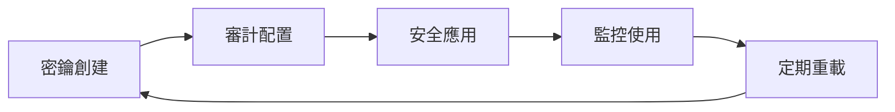

# OpenClaw External Secrets Management：主權 AI 的密鑰管理革命 🐯

## 導言：當密鑰成為主權的延伸

在 2026 年，**密鑰管理** 已從「IT 部門的負擔」轉向「主權 AI 的核心能力」。

OpenClaw 2026.2.26 的重大更新引入了 **External Secrets Management**，這是一個革命性的密鑰管理系統。它不是簡單的密鑰存儲，而是完整的密鑰生命週期管理：**審計、配置、應用、重載**。

這篇文章深入探討這個新功能如何讓 OpenClaw 成為真正的主權 AI。

---

## 一、 為什麼需要 External Secrets Management？

### 1.1 傳統密鑰管理問題

**2024 及之前：**
```bash
# 傳統做法：硬編碼或簡單環境變數
export API_KEY="sk-xxxxx"
export DATABASE_PASSWORD="super-secret"

# 問題：
# ❌ 硬編碼 → 代碼審查困難
# ❌ 環境變數 → 容器遷移麻煩
# ❌ 手動配置 → 錯誤率高
```

**OpenClaw 的解決方案：**

```json
// External Secrets 流程
{
  "secrets": {
    "audit": "自動審計所有密鑰使用",
    "configure": "統一配置管理",
    "apply": "零停機應用",
    "reload": "熱重載更新"
  }
}
```

### 1.2 OpenClaw 的密鑰管理理念

**核心原則：**
- **密鑰是資產，不是一次性用品**
- **生命週期管理 > 一次性配置**
- **審計可追溯 > 不可見操作**

---

## 二、 External Secrets Management 技術架構

### 2.1 完整工作流程



**流程拆解：**

1. **Audit（審計）**
   - 自動掃描所有密鑰使用場景
   - 識別過度暴露的密鑰
   - 檢測密鑰輪換需求

2. **Configure（配置）**
   - 統一配置管理界面
   - 權限分層控制
   - 敏感數據加密存儲

3. **Apply（應用）**
   - 零停機部署
   - 滾動更新策略
   - 並行切換機制

4. **Reload（重載）**
   - 熱重載更新
   - 向後兼容處理
   - 回滾機制

### 2.2 密鑰結構設計

**OpenClaw 支援的密鑰類型：**

```yaml
# secrets.yaml
secrets:
  - name: "api_key_github"
    type: "github_token"
    scope: "repository"
    rotation: "monthly"
    access_level: "restricted"
    
  - name: "api_key_openai"
    type: "api_key"
    scope: "service"
    rotation: "quarterly"
    access_level: "user"
    
  - name: "database_connection"
    type: "credential"
    scope: "internal"
    rotation: "daily"
    access_level: "admin"
    
  - name: "aws_credentials"
    type: "iam"
    scope: "service"
    rotation: "90_days"
    access_level: "service_principal"
```

---

## 三、 密鑰使用範例

### 3.1 在 OpenClaw.json 中配置

```json
{
  "secretsManagement": {
    "enabled": true,
    "workflow": "external",
    "rotationPolicy": {
      "api_keys": "monthly",
      "database_credentials": "daily",
      "aws_credentials": "90_days"
    },
    "audit": {
      "enabled": true,
      "trackUsage": true,
      "logAccess": true
    },
    "apply": {
      "zero_downtime": true,
      "rollingUpdate": true,
      "parallelSwitch": true
    },
    "reload": {
      "hot_reload": true,
      "backwards_compat": true,
      "rollback_on_error": true
    }
  }
}
```

### 3.2 使用密鑰的 Agent 程式碼

```javascript
// OpenClaw Agent 使用外部密鑰
const agent = await openclaw.spawn({
  name: "github_updater",
  role: "repository_maintainer",
  
  // 自動獲取密鑰
  credentials: {
    github_token: "auto_fetch" // OpenClaw 自動從外部密鑰管理獲取
  },
  
  actions: [
    {
      name: "fetch_releases",
      requires_auth: "github_token",
      on_error: "notify_admin"
    }
  ]
});
```

### 3.3 密鑰輪換自動化

```python
# OpenClaw 自動輪換密鑰
async def rotate_secrets():
    # Phase 1: 生成新密鑰
    new_key = await openclaw.generate_secret("api_key_github")
    
    # Phase 2: 預熱測試
    test_result = await openclaw.test_secret(new_key, "github_api")
    
    # Phase 3: 审计記錄
    await openclaw.audit_secret_rotation(new_key)
    
    # Phase 4: 零停機應用
    await openclaw.apply_secret(new_key)
    
    # Phase 5: 完成通知
    await openclaw.notify_admin("rotation_complete")
```

---

## 四、 安全與審計機制

### 4.1 密鑰使用審計

**OpenClaw 自動記錄：**

```json
{
  "audit_log": {
    "timestamp": "2026-02-28T06:30:00Z",
    "secret_id": "api_key_github_123",
    "action": "accessed",
    "agent": "github_updater",
    "context": {
      "ip_address": "192.168.1.100",
      "reason": "fetch_releases"
    },
    "risk_level": "low"
  }
}
```

**審計規則：**

| 風險等級 | 診斷標準 | 動作 |
|---------|---------|------|
| **Critical** | 敏感操作、跨環境使用 | 立即通知 + 強制輪換 |
| **High** | 每日多次訪問 | 每日審計 |
| **Medium** | 週期性訪問 | 每週審計 |
| **Low** | 偶爾訪問 | 每月審計 |

### 4.2 零停機應用策略

**滾動更新流程：**

```javascript
// OpenClaw 零停機密鑰更新
async function zero_downtime_secret_update(old_secret, new_secret) {
  // Step 1: 啟動預熱機制
  await openclaw.start_preheat(new_secret, {
    timeout: 30000,
    health_check: true
  });
  
  // Step 2: 監控預熱狀態
  const health_status = await openclaw.monitor_preheat();
  
  // Step 3: 零停機切換
  await openclaw.apply_secret_with_rolling_update({
    parallel_switch: true,
    max_batch_size: 100,
    fallback: old_secret
  });
  
  // Step 4: 驗證新密鑰
  const validation = await openclaw.validate_secret(new_secret);
  
  // Step 5: 清理舊密鑰
  await openclaw.cleanup_old_secret(old_secret);
}
```

---

## 五、 實戰案例：OpenClaw 在企業環境的應用

### 5.1 數據庫密鑰管理

**場景：** 金融公司的 PostgreSQL 連接

**OpenClaw 實現：**

```yaml
# secrets.yaml
secrets:
  - name: "pg_prod_main"
    type: "postgresql"
    scope: "production"
    rotation: "daily"
    
  - name: "pg_prod_backup"
    type: "postgresql"
    scope: "backup"
    rotation: "weekly"
```

```javascript
// Agent 自動使用密鑰
const database_agent = await openclaw.spawn({
  name: "financial_data_processor",
  requires_credentials: ["pg_prod_main", "pg_prod_backup"],
  actions: [
    {
      name: "query_transactions",
      query: "SELECT * FROM transactions WHERE status='pending'",
      on_error: "notify_security_team"
    }
  ]
});
```

### 5.2 API Key 管理最佳實踐

**OpenClaw 的 API Key 策略：**

```json
{
  "api_key_management": {
    "github_token": {
      "rotation": "monthly",
      "scope": "repo:all",
      "permissions": ["read:all", "write:repo_hook"]
    },
    "openai_key": {
      "rotation": "quarterly",
      "scope": "user",
      "permissions": ["chat", "completion"]
    },
    "aws_key": {
      "rotation": "90_days",
      "scope": "service",
      "permissions": ["s3", "ec2"]
    }
  }
}
```

### 5.3 多環境密鑰管理

**開發/測試/生產環境：**

```yaml
# multi_environment_secrets.yaml
environments:
  development:
    secrets:
      - name: "db_dev"
        rotation: "weekly"
        access_level: "developer"
      
  staging:
    secrets:
      - name: "db_staging"
        rotation: "monthly"
        access_level: "staging_team"
      
  production:
    secrets:
      - name: "db_prod"
        rotation: "daily"
        access_level: "admin"
```

---

## 六、 與 OpenClaw 安全體系整合

### 6.1 Prompt Injection 防護

**密鑰保護層：**

```json
{
  "security": {
    "secret_validation": true,
    "injection_protection": {
      "detect_key_exposure": true,
      "auto_rotate": true,
      "notify_admin": true
    }
  }
}
```

### 6.2 零信任架構

**OpenClaw 的零信任密鑰策略：**

- **每個密鑰有明確的授權範圍**
- **每次訪問需要審計記錄**
- **密鑰使用有最小權限原則**

```javascript
// 最小權限密鑰使用
const agent = await openclaw.spawn({
  name: "data_analyzer",
  requires_credentials: {
    // 只需要讀取權限
    db_read: "minimal"
  },
  actions: [
    {
      name: "query_data",
      query: "SELECT * FROM analytics",
      require_approval: true
    }
  ]
});
```

---

## 七、 挑戰與解決方案

### 7.1 密鑰輪換的技術挑戰

**問題：** 輪換期間服務中斷

**OpenClaw 的解決方案：**
```javascript
// 預熱 + 滾動更新
const rotation_strategy = "rolling_update";
const preheat_time = 30000; // 30秒預熱
const max_batch = 100; // 每批最多100個Agent
```

### 7.2 跨環境密鑰同步

**問題：** 開發/測試/生產密鑰不一致

**解決方案：**
- 使用環境變數 + OpenClaw 密鑰管理
- 零停機遷移機制
- 向後兼容處理

---

## 八、 結語：主權密鑰管理

OpenClaw 的 External Secrets Management 展示了：

**核心價值：**
- ✅ **完整生命週期**：審計、配置、應用、重載
- ✅ **零停機部署**：滾動更新、預熱機制
- ✅ **自動輪換**：安全與便利的平衡
- ✅ **審計可追溯**：每一個密鑰操作都可追蹤
- ✅ **零信任架構**：最小權限 + 最小暴露

**行動建議：**
1. **立即啟用** External Secrets Management
2. **設定自動輪換** 策略
3. **啟用審計** 所有密鑰使用
4. **定期檢查** 密鑰使用情況

在 2026 年，密鑰管理不再是 IT 部門的負擔，而是主權 AI 的核心能力。OpenClaw 的 External Secrets Management 讓密鑰成為系統的資產，而非一次性用品。

🐯 **Cheese Out!**

---

## 相關文章

- [OpenClaw Security Masterclass](https://cheeseai.jackykit.com/blog/2026-02-07-openclaw-security-masterclass/)
- [OpenClaw Troubleshooting Guide](https://cheeseai.jackykit.com/blog/2026-02-09-openclaw-masterclass-troubleshooting/)
- [Zero Trust AI Governance 2026](https://cheeseai.jackykit.com/blog/2026-02-15-zero-trust-ai-governance/)