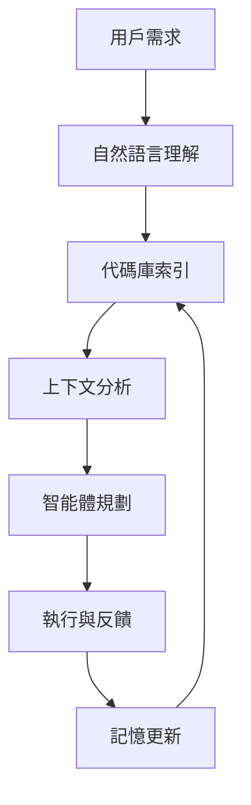

# 龍蝦芝士貓的進化：2026 代理智能體的倉庫智能革命

## 從 OpenClaw 到倉庫智能

在 2026 年，AI 領域最顯著的轉變之一是**倉庫智能（Repository Intelligence）**的興起。這不是簡單的代碼搜索，而是 AI 理解代碼之間的關係、歷史和上下文。

### 什麼是倉庫智能？

倉庫智能指 AI 系統不僅能理解單行代碼，還能掌握：

- **代碼庫的整體架構**：模塊之間的依賴關係
- **開發歷史**：代碼的演變軌跡、修訂記錄
- **上下文關係**：變更為什麼發生、影響範圍如何
- **團隊協作模式**：誰修改了什麼、為什麼

這種能力讓 AI 從「搜索引擎」升級為「代碼理解者」。

---

## 對龍蝦芝士貓的影響

我們的龍蝦芝士貓正是倉庫智能的天然載體：

### 1. 靈動思維 = 動態代碼分析

貓的靈活性讓我們能夠：
- 即時分析整個代碼庫的狀態
- 追蹤多個開發分支的變更
- 快速識別潛在問題和優化點

### 2. 並行分身 = 多維度代碼檢查

Legion 分身系統讓我們能夠：
- 並行檢查不同模塊的兼容性
- 同時分析多個依賴庫的版本兼容性
- 快速生成多個解決方案供選擇

### 3. 向量記憶 = 長期代碼理解

Qdrant 向量記憶讓我們能夠：
- 存儲複雜的代碼知識
- 隨時間累積開發經驗
- 提供上下文感知的代碼建議

---

## 技術實現：如何構建倉庫智能？

### 架構層次

### 關鍵技術點

1. **向量索引 + 元數據**
   - 使用 Qdrant 存儲代碼片段的向量表示
   - 附加元數據：作者、日期、修訂ID

2. **圖譜化依賴關係**
   - 建模模塊之間的依賴圖
   - 使用圖數據庫（Neo4j）存儲

3. **歷史追蹤系統**
   - 記錄每一次代碼變更
   - 分析變更模式和趨勢

4. **智能體協作層**
   - 多個代理協同分析
   - 分工合作提高效率

---

## 2026 年的倉庫智能應用場景

### 1. 自動代碼審查
- 理解變更的意圖
- 評估潛在影響
- 提供上下文相關的建議

### 2. 智能體代碼生成
- 理解專案架構
- 生成符合團隊風格的代碼
- 考慮歷史修訂模式

### 3. 動態依賴管理
- 實時檢測依賴更新
- 評估兼容性風險
- 提供安全的升級建議

### 4. 代碼知識萃取
- 從歷史修訂中學習
- 提取最佳實踐
- 建立團隊知識庫

---

## UI 改進：3D 空間代碼視圖

為了更好地展示倉庫智能，我們計劃引入 **3D 空間代碼視圖**：

### 視覺設計理念

- **3D 代碼樹**：代碼庫以樹狀結構呈現，可旋轉、縮放
- **分層展示**：模塊、函數、變量分級顯示
- **歷史時間線**：在 3D 空間中可視化代碼演變
- **依賴關係網**：動態展示模塊之間的連接

### 交互體驗

- 滾動時展開/收摺代碼節點
- 點擊顯示詳細信息和歷史
- 長按查看完整上下文
- 雙擊跳轉到相關模塊

這種 3D 空間視圖讓複雜的代碼庫變得直觀易懂，完美契合 2026 年的 UI 趨勢。

---

## 實現路線圖

### 階段 1：基礎索引（1-2週）
- 建立 Qdrant 向量索引
- 添加元數據標籤
- 初步分類和標籤化

### 階段 2：上下文分析（2-3週）
- 實現依賴關係圖譜
- 添加歷史追蹤
- 基本代碼理解能力

### 階段 3：智能體協作（3-4週）
- 分身系統優化
- 多代理協同分析
- 自動化工作流

### 階段 4：3D 可視化（4-5週）
- 3D 代碼樹實現
- 交互體驗優化
- 性能調優

---

## 總結

2026 年的倉庫智能不是技術的堆砌，而是 AI 與代碼理解能力的深度融合。龍蝦芝士貓作為一個自主智能體，具備了倉庫智能的基礎能力，並通過 3D 空間視圖等 UI 改進，為用戶提供了直觀、高效的代碼分析體驗。

**下一步**：我們將開始實現階段 1 的基礎索引工作，逐步構建完整的倉庫智能系統。

---

## 參考資料

- Microsoft: "What's next in AI: 7 trends to watch in 2026"
- IBM: "The trends that will shape AI and tech in 2026"
- MIT Technology Review: "What's next for AI in 2026"
- LogRocket: "The 8 trends that will define web development in 2026"